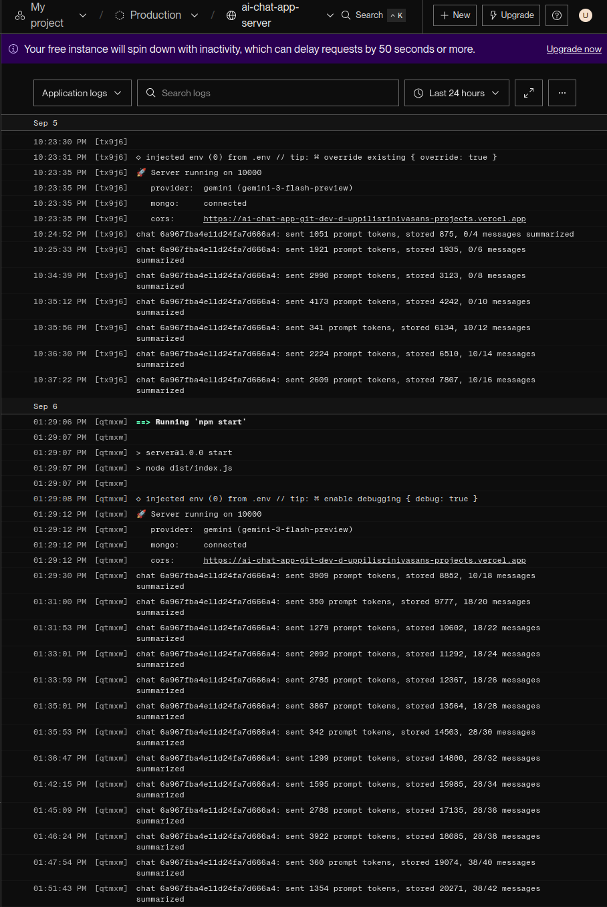
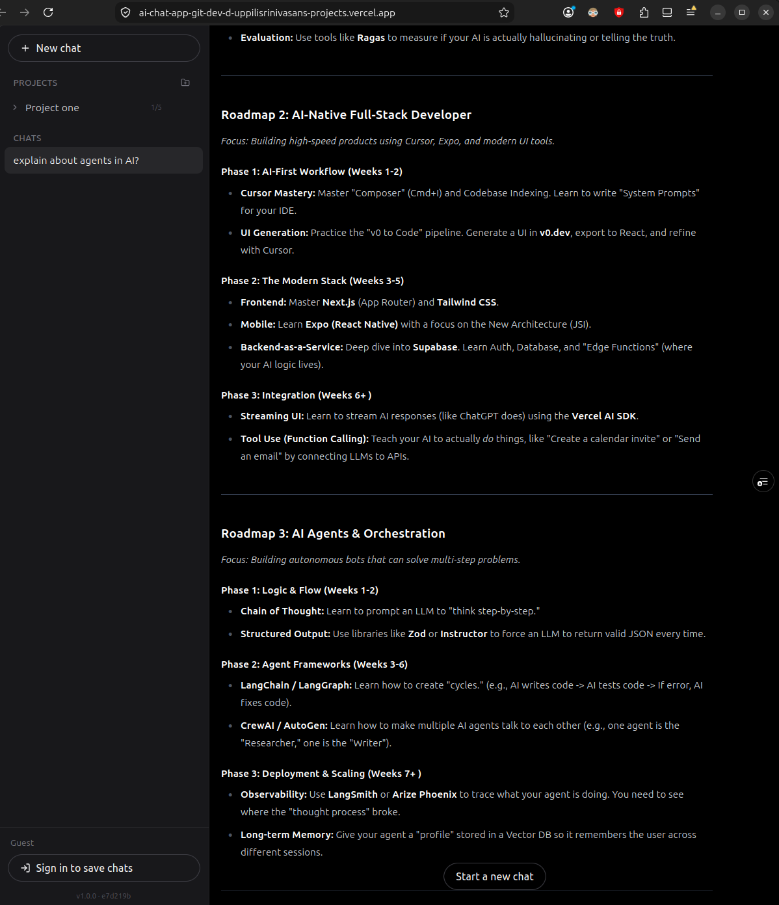

# AI Chat App

A ChatGPT-style chat app powered by Google Gemini. Replies stream word by word,
chats are saved per account, and you can start without signing up.

**Live:** https://ai-chat-app-seven-beryl.vercel.app

- Streaming replies, markdown and syntax-highlighted code with a copy button
- Guest accounts — sign in with Google later and your chats come with you
- Chat history in a sidebar; rename, delete, edit and resend any message
- Projects group related chats — click one to see the chats filed inside
- Long chats keep going: older messages fold into a rolling summary rather than
  being dropped, so what gets sent to Gemini stays flat as a chat grows
- Mobile-first, sidebar collapses to a drawer

| Layer    | Tech                                                      |
| -------- | --------------------------------------------------------- |
| Frontend | React 19, Vite, TypeScript, Tailwind, Zustand              |
| Backend  | Node 20+, Express 5, TypeScript, Mongoose                  |
| Data     | MongoDB · AI: Google Gemini                                |
| Auth     | Google Sign-In + guests, JWT in an httpOnly cookie         |
| Hosting  | Vercel · Render · MongoDB Atlas                            |

## Run it

Two separate npm projects. You need a local MongoDB and a
[Gemini API key](https://aistudio.google.com/app/apikey).

```bash
# server/.env
GEMINI_API_KEY=your-key
MONGODB_URI_DEV=mongodb://127.0.0.1:27017/ai-chat-app
JWT_SECRET=$(openssl rand -hex 32)
```

```bash
cd server && npm install && npm run dev   # :5000
cd client && npm install && npm run dev   # :5173
```

Open http://localhost:5173 and click **Continue as guest**.

Boot fails loudly and names the missing variable rather than breaking on the
first request. Full variable list is in [CLAUDE.md](CLAUDE.md).

**Google Sign-In is optional.** Create an OAuth client ID, add
`http://localhost:5173` as an authorised origin, then set the same ID as
`GOOGLE_CLIENT_ID` (server) and `VITE_GOOGLE_CLIENT_ID` (client). Without it the
Google button just doesn't render.

## Commands

Run inside `server/` or `client/`.

```bash
npm run dev · build · test · test:coverage · typecheck
npm run lint     # client only
```

Tests sit next to the code they cover. Coverage is enforced at 80%.

## API

`POST /gemini/chat` takes `{ chatId, message }` and replies with Server-Sent
Events, not JSON — the server owns the history, so you never send it. Create a
chat with `POST /chats` first.

Everything else: `/auth/{signup,login,anonymous,google,logout,me}`, plus
`/chats/:id` and `/projects/:id` for GET, PATCH, DELETE. Deleting a project
deletes its chats with it.

## Limits

| | |
| --- | --- |
| Chat | 20k tokens stored, then start a new one |
| Chats per project | 5 |
| New projects | 5 per day |

Once 4k tokens are unsummarized, the oldest complete exchanges fold into a
summary capped at 400 tokens. Limits are enforced server-side and rejected with
a `code` (`CHAT_FULL`, `PROJECT_FULL`, `PROJECT_LIMIT_REACHED`), not just a
message.

## Compaction in practice

Two things happen as a chat grows: the oldest exchanges fold into a rolling
summary, and a hard cap eventually ends the chat. One production conversation
shows both.



Each line is one turn, from that chat's 4th message to its 42nd. `sent` is what
Gemini actually billed for the request, `stored` is every token the chat has
ever held, and `x/y` is how far the summary reaches into the transcript.

Four folds fire, each one when the unsummarized tail crosses 4k:

| Turn | `sent` before | `sent` after | Summary reach |
| --- | --- | --- | --- |
| 10:35 | 4173 | **341** | 0 → 10 |
| 01:31 | 3909 | **350** | 10 → 18 |
| 01:35 | 3867 | **342** | 18 → 28 |
| 01:47 | 3922 | **360** | 28 → 38 |

The shape matters more than any single drop. `sent` sawtooths between ~340 and
~4k and never trends upward, while `stored` climbs from 875 to 20,271. On the
last turn the model answers with 1,354 tokens of context where the raw
transcript would have cost roughly 20k — the same conversation for a fifteenth
of the prompt.

Cost per turn is flat. Conversation length is not.

Then `stored` crosses the 20k cap, and the chat is closed:



The composer is gone, replaced by the only action left. The server refuses first
— `POST /gemini/chat` answers 409 `CHAT_FULL` before `flushHeaders()`, since an
open SSE stream can no longer carry a status — and the client renders that
refusal rather than predicting it.

Note which number the cap counts. Capping tokens *sent* would never trigger,
because compaction holds that figure flat; that is exactly what the sawtooth
above shows. So the cap counts tokens ever *stored*, which only ever grows.

## Deploying

Frontend on Vercel, backend on Render.

**Set `VITE_API_BASE_URL=/api` on Vercel.** `client/vercel.json` forwards
`/api/*` to Render so the API looks same-origin. Point the client straight at
the Render URL instead and auth breaks confusingly — sign-in appears to work,
then every request 401s, because a `sameSite=lax` cookie isn't sent across
domains.

On Render set `NODE_ENV=production` (switches to the `_PROD` variables and marks
the cookie secure) and put your Vercel URL in `CORS_ORIGIN_PROD`.

## Branches

`main` is stable, `dev` is where work lands first, merged via PR.
`.env` files are gitignored — never commit them.
